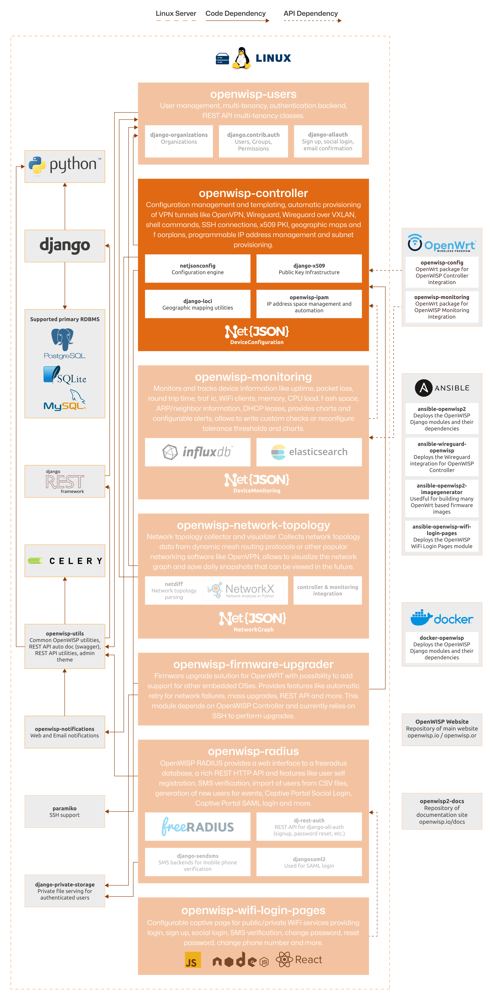

Controller
==========

.. seealso::

    **Source code**: `github.com/openwisp/openwisp-controller
    <https://github.com/openwisp/openwisp-controller>`_.

OpenWISP Controller is responsible of of managing the core resources of
the network and allows automating several aspects like adoption,
provisioning, VPN tunnel configuration, generation of X509 certificates,
subnet and IP address allocation and more.

For a full introduction please refer to :doc:`user/intro`.

The following diagram illustrates the role of the Controller module within
the OpenWISP architecture.

    **OpenWISP Architecture: highlighted controller module**

.. important::

    For an enhanced viewing experience, open the image above in a new
    browser tab.

    Refer to :doc:`/general/architecture` for more information.

.. toctree::
    :caption: Controller Module Usage Docs
    :maxdepth: 1

    user/intro.rst
    user/device-config-status.rst
    user/templates.rst
    user/variables.rst
    user/device-groups.rst
    user/push-operations.rst
    user/shell-commands.rst
    user/import-export.rst
    user/organization-limits.rst
    user/wireguard.rst
    user/vxlan-wireguard.rst
    user/zerotier.rst
    user/openvpn.rst
    user/subnet-division-rules.rst
    user/rest-api.rst
    user/settings.rst

.. toctree::
    :caption: Controller Module Developer Docs
    :maxdepth: 2

    Developer Docs Index <developer/index.rst>
