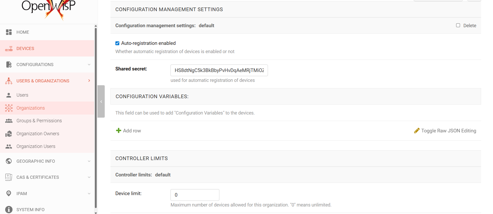

Organization Limits
===================

You can restrict the number of devices managed by each organization.

To set these limits:

1. Navigate to **USERS & ORGANIZATIONS** on the left-hand navigation menu.
2. Go to **Organizations**.
3. Click on the specific organization you want to limit.
4. In the **CONTROLLER LIMIT** section, set the desired limit.

Refer to the screenshot below for guidance:

